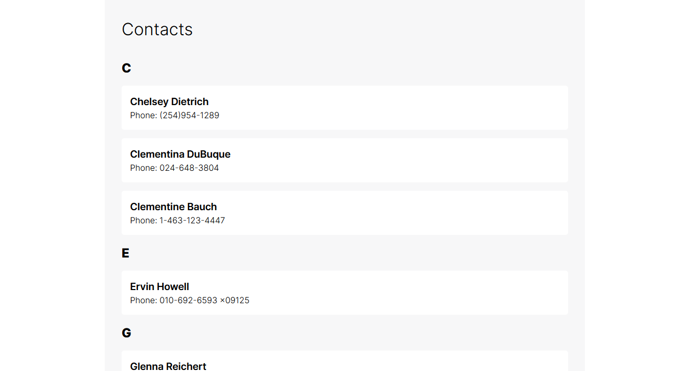

# Contact List Vue3 Project



## [Find this project hosted here](https://codesandbox.io/p/github/kchndesign/contacts-list/main?file=%2FREADME.md)

This is an exercise in using Vue3 and the Composition API to consume
https://jsonplaceholder.typicode.com/users. It's a simple Vue project that
fetches a list of users and sorts them by the first letter of their name. It
also allows the user to click on each result and see more details.

## Contents

-   ## [How to run](#how-to-run-1)
-   ## [Project Brief](#project-brief-1)
-   ## [Implementation Notes](#implementation-notes-1)
-   ## [Known Issues](#known-issues-1)

## How to run

If you're trying to run this project on your local environment, make sure to do
these steps in order.

### Install dependencies

```sh
npm install
```

### Start development server

```sh
npm run dev
```

Navigate your browser to `localhost:5173` or whatever port the terminal window
gives you.

## Project Brief

### Aims

The aims of this project were the following:

-   Gain familiarity with Vue3 (having only worked commercially with Vue2)
-   Gain familiarity with using Typescript and the Composition API with Vue3
-   Demonstrate my skills in building with front end frameworks and consuming
    data.

### Requirements

-   Write a responsive "Contacts" application that allows the user to browse
    their contacts.
-   Make use of https://jsonplaceholder.typicode.com/ (/users are the contacts)
-   Use either VueJS, Angular or React
-   Make it visually appealing
-   No need to implement Create/Update/Delete

## Implementation Notes

### Composition API

The decision to use the Composition API rather than the Options API was mostly
driven by curiosity and the recommendation in the Vue docs that Typescript works
better with Composition. Having worked mostly with the Options API with Vue2,
the Composition API felt closer to React than vue. Similarly with React, the
Composition API requires that you use a `<script setup>` section that uses
functional hooks to set up reactive variables and access lifecycle methods.

Having no concrete structure for you to organise your code into data, methods
and so on, the Composition API allows you to organise your code by their
relevant function or domain, rather than the type of code. While I consider this
a good thing, much like React, you must be diligent with how you organise your
code, because there is nothing stopping you from writing disorganised code.

### Modal Close button in the bottom right.

This is intentional. For mobile users, interaction at the top of the screen is
often hard to reach.

### Component Architecture with regards to modals

This app allows the user to click on a contact's card to display a modal showing
more details about the contact. I chose to include the `ContactModal` component
_inside_ the `ContactCard` component.

This is because the `ContactCard` component knows what contact needs to be shown
when itself is clicked. Implementing a modal in the parent of `ContactCard`
would require `ContactCard` to notify the parent that it has been clicked and
which contact to display. This requires extra events being emitted, and extra
state to store the selected contact, which will be stale when the modal isn't
showing.

## Known issues

-   The google maps link doesn't do anything (I don't know why)
-   It also doesn't end up displaying a pin at the correct latitude and
    longitude.
-   In mobile layouts when the modal is scrolled down. The close button doesn't
    move and is left in the middle somewhere.
